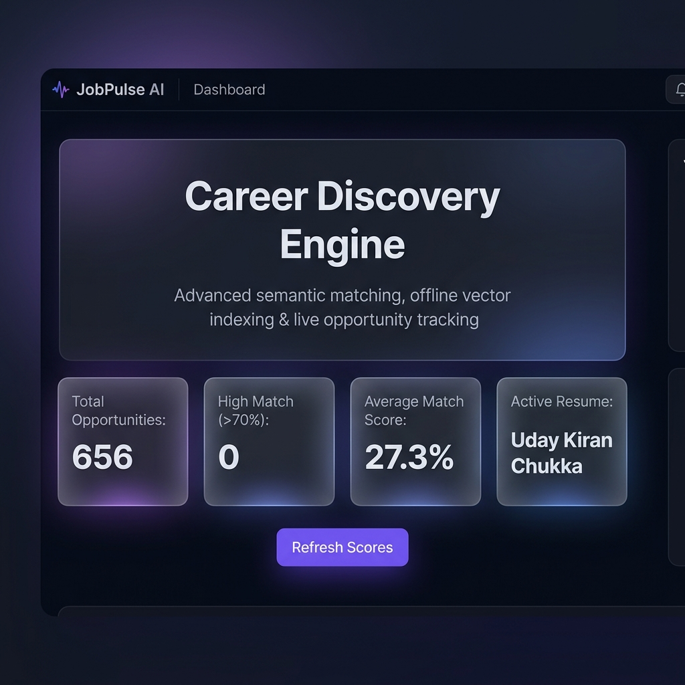

# 🔍 JobPulse AI (v2.0)

**AI-powered career architect for advanced semantic job matching and live opportunity tracking.**

JobPulse AI is a comprehensive tool designed to streamline your job search process. It leverages local NLP models to find the best-fitting jobs based on your resume and provides a powerful dashboard to manage your applications.

 *(Placeholder for dashboard image)*

## ✨ Key Features

- **🚀 Live Job Scraping**: Real-time job extraction using `python-jobspy` from multiple platforms.
- **🧠 Semantic Matching**: Advanced AI analysis comparing your resume against job descriptions using local `all-MiniLM-L6-v2` embeddings.
- **📄 Resume Management**: Upload multiple resumes (PDF/TXT), analyze them, and switch between them to see different match scores.
- **📊 Interactive Dashboard**: A premium Streamlit-based UI with advanced filtering, metrics, and data visualization.
- **🔒 Privacy First**: Both vector generation and live scraping run 100% locally on your machine.
- **💼 Opportunity Tracking**: Save, filter, and track job opportunities in a local SQLite database.
- **🔗 Quick Apply**: Open multiple job application links directly in your browser with a single click.

## 🛠️ Technology Stack

- **Frontend**: [Streamlit](https://streamlit.io/)
- **Database**: [SQLite](https://www.sqlite.org/)
- **NLP/ML**: 
  - `sentence-transformers` (Local Embeddings)
  - `scikit-learn`
  - `nltk`
  - `gensim`
- **Scrapers**: [python-jobspy](https://github.com/cullenwatson/JobSpy)
- **Data Handling**: `pandas`, `pdfplumber`, `PyPDF2`

## 🚀 Getting Started

### Prerequisites

- Python 3.11 or 3.12
- [Poetry](https://python-poetry.org/docs/#installation) (recommended) or `pip`

### Installation

#### Option 1: Using Poetry (Recommended)
```bash
poetry install
```

#### Option 2: Using Makefile (with Conda)
```bash
make install
```

#### Option 3: Using pip
```bash
pip install -r requirements.txt
```

3. **Set up environment variables**:
   Create a `.env` file in the root directory:
   ```bash
   cp .env-template .env
   ```

### Running with Docker

1. **Build the image**:
   ```bash
   docker build -t jobpulse .
   ```

2. **Run the container**:
   ```bash
   docker run -p 8501:8501 --env-file .env jobpulse
   ```

*Note: You can also use the provided `.devcontainer` for a pre-configured development environment in VS Code.*

### Running the Application

Start the Streamlit dashboard locally:
```bash
streamlit run jobhunter/main.py
```
Or using the Makefile:
```bash
make run
```

## 🛠️ Development

- **Run Tests**: `make test`
- **Format Code**: `make format`
- **Check Coverage**: `make coverage`

## 📂 Project Structure

- `jobhunter/`: Core application package.
  - `main.py`: Streamlit dashboard and UI logic.
  - `search_jobs.py`: Job scraping integration using `python-jobspy`.
  - `dataTransformer.py`: NLP processing and embedding generation.
  - `SQLiteHandler.py`: Database management for jobs and resumes.
  - `extract.py`: Data extraction pipelines.
  - `config.py`: Configuration settings and search parameters.
- `tests/`: Automated test suite for core logic.
- `all_jobs.db`: Local SQLite database storing job listings and resumes.

## 🤝 Contributing

Contributions are welcome! Please see [CONTRIBUTING.md](CONTRIBUTING.md) for details on our code of conduct and the process for submitting pull requests.

## 📄 License

This project is licensed under the MIT License - see the [LICENSE](LICENSE) file for details.

---
*Built with ❤️ for job hunters everywhere.*
